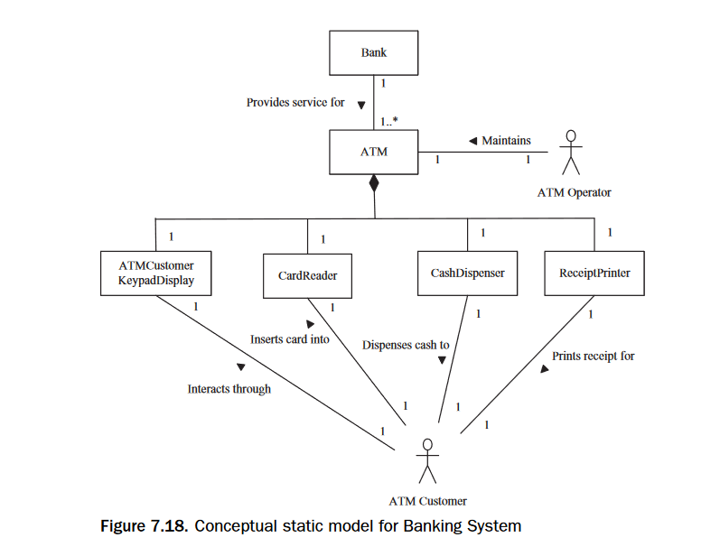
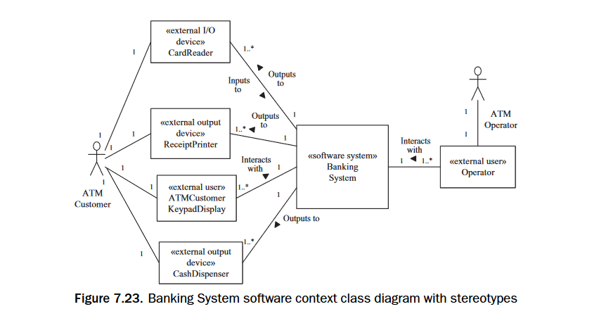

## Deliverable 3 - System Context Class Model

This deliverable includes the conceptual status model and the
system context class model for Beanstalk.

The Conceptual Status Model deals with only the software itself and its entities.
Think about it like being inside of the Black Box, unable to look outside.

- No external devices
- No I/O
- Just the software

The System Context Class Diagram is a bigger picture. It is the
black box AND its environment. This means that we reconcile how the software works along with its devices,
and the devices are now entities in our model.

- Includes external I/O and actors
- Is the bigger picture

For the most part, the notation is the same between both. The only difference is what they concern.
