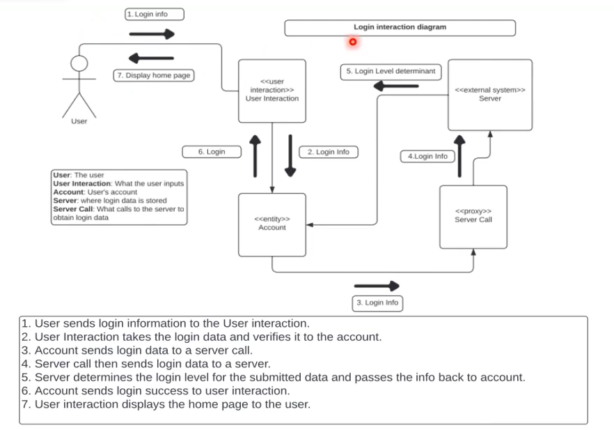
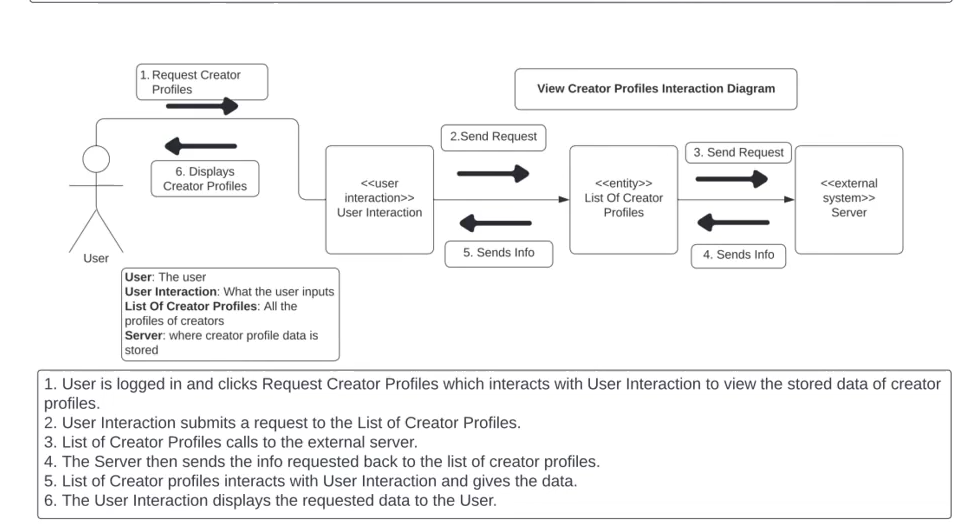

## Starting

There is a starting template (template.drawio) that contains common elements to build these diagrams. Start there.

## Examples

## Stereotypes

- **user interaction**: An interface that a user uses. For our purposes, this will always be the first object the user uses.

- **entity**: Anything that is an abstract software concept, like an account.

- **external system**: A system that we do not control and we don't care about its internals. This includes things like servers, as well as otehr software.

